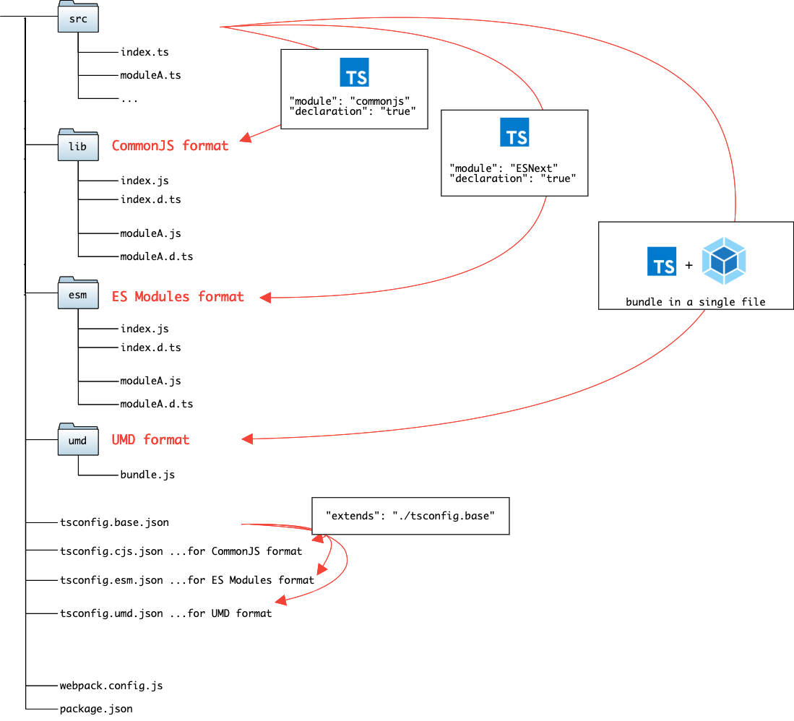

# @Academy/Logger

---------------------------------

## Package development
### File Structure


```zsh
src/ # Source files written in TypeScript
  - moduleA.ts
  - moduleB.ts
  - index.ts
lib/ # CommonJS format (`module.exports/require`) JS files
  - moduleA.js
  - moduleB.js
  - index.js
esm/ # ES Modules format (`import/export`) JS files
  - moduleA.js
  - moduleB.js
  - index.js
umd/ # UMD format, bundled JS file
  - my-typescript-package.js
```

### How to Develop

NPM:
```zsh
$ npm install
$ npm run build # generates `lib`, `esm`, and `umd`
```

Yarn:
```zsh
$ yarn
$ yarn build # generates `lib`, `esm`, and `umd`
```

### How to Test

To test package in some project you have to add package named YALC:
```bash
npm i -g yalc
```

This CLI tool helps you to develop and publish packages locally. Read more about YALC 
usage here https://www.npmjs.com/package/yalc.

To run your package in other project you have to do the following commands:
```bash
# In logger project
yalc publish
# In target project
yalc add @academy/logger
yarn
```

Each time you are updating this package you have to do the following:
```bash
# In logger
# You have to update package ver in package.json to prevent caching, then
yalc push # Updates package in all bind projects
# In target project
yarn
```

### How to publish to GitLab

To publish new version of package you have to:

1) Go to "Project Setting > Repository > Deploy Tokens"
2) Create new token with `read_package_registry` and `write_package_registry` permissions
3) Run command `GITLAB_AUTH_TOKEN=<your-token> yarn npm publish`

You can read more about project configuration for GitLab Packages [here](https://shivamarora.medium.com/publishing-your-private-npm-packages-to-gitlab-npm-registry-39d30a791085).
